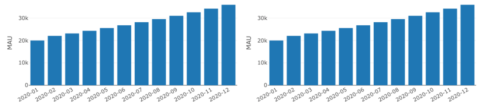
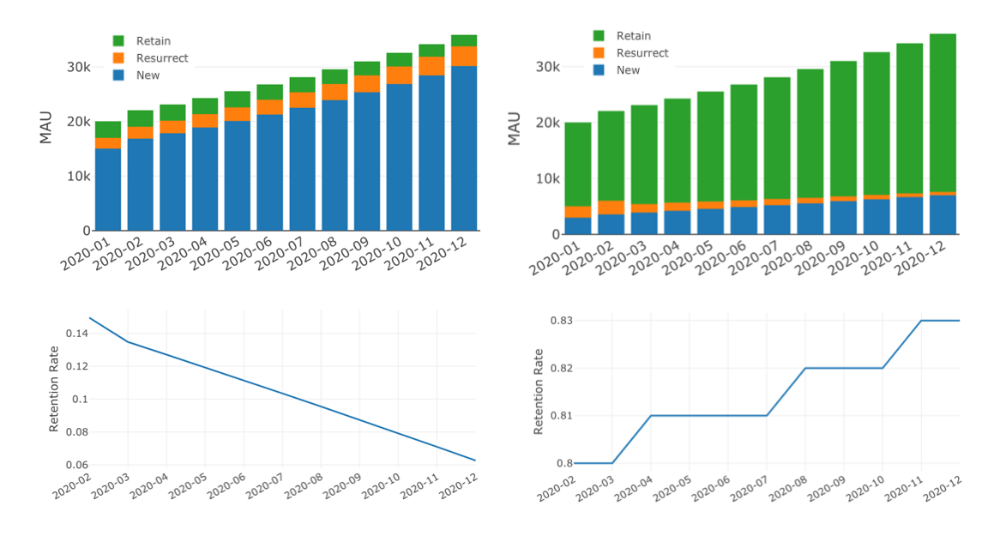
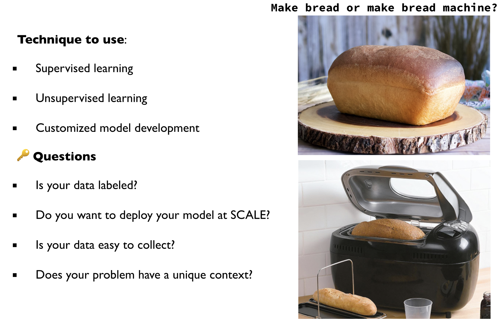

```{r setup, include=FALSE}
knitr::opts_chunk$set(echo = FALSE, message = F, error = F, warning =  F)
```

## Why do you care?

> If you can't measure it, you can't improve it.  
------ Peter Drucker

## Why do you care?

> If you can't measure it, you can't improve it.  
------ Peter Drucker

What to measure? Let's start with a caveat:

> When a measure becomes a target, it ceases to be a good measure. 
------ Goodhart's Law

## What do organizations track?

> **P**age view, **U**ptime, **L**atency, **S**even-day active users and **E**arning (PULSE) 

> **A**cquisition, **A**ctivation, **R**etention, **R**eferral, **R**evenue (AARRR!) or user funnel

- Commonly used large-scale metrics
- Focus on business or technical aspects of a product
- They are all extremely important and are related to user experience.

## However, they don't give the full story

PULSE and AARRR: low-level or indirect metrics of user experience

- Problematic when used to evaluate the impact of user interface (UI) changes
- Ambiguous interpretation

Why is there a rise in page views?

Are the two the same happy story?




## Are the two the same happy story?




## What is user-centered metric tracking!?

<center></center>

## Behavior (what happen?) + Attitude (what is perceived?)

- We need a complementary metrics framework

> **H**appiness, **E**ngagement, **A**doption, **R**etention, and **T**ask success (HEART)

> - Happiness and Task success: user experience metrics
> - Engagement, Adoption, and Retention: user hebavior
> - It is not always appropriate to employ metrics from every category, but referring to the framework helps to make an explicit decision about what to include.

## Happiness

Metrics that are attitudinal in nature that is often tracked using survey.

- Satisfaction
- Visual appeal
- Likelihood to recommend
- Perceived ease of use

> For example: Change aversion after a major redesign

## Engagement

Users' level of involvement with a product:

- frequency: number of visits per user per week
- intensity: number of minutes per user per day
- depth of interaction over time: number of features used per user per week

> For example: Gmail team chose the percentage of active users who visited the product on five or more days during the last week as the measure of user engagement. 

## Adoption and Retention

- Provide insight into active users and address the problem of distinguishing new users from existing users
- Adoption: How many users start using a product during a given time period
- Retention: How many of the users from a given time period are still present in some later time period

> It can be tricky to define "active" or "using a product". 

> For example: Netlify had a surge in signup during a company-held tech conference. However, the daily active users didn't change that much.  

## Task success

Behavioral metrics of user experience

- efficiency (time to complete a task)
- effectiveness (percent of tasks completed)
- error rate (percent of failure)

> Depending on the task, it can be difficult to track using the weblog because it is unclear which task the user was trying to accomplish. 

> For example: task success of a search query is much harder to get than task success of signup

## Data Science Types v.s Needs


## Types of Questions 

- Comparison: 
    - Are males more inclined to buy our products than females?
    - Are there any differences in customer satisfaction in different business districts?

- Description:
    - Is the distribution of annual income normal?
    - Are there outliers?
    - What are the means of different customer segments?

- Clustering:
    - Which customers have similar product preferences? 
    - Which printer performs a similar pattern to the broken ones?
    - How many different themes are there in the corpus?

## Types of Questions 

- Classification:
    - Who is more likely to buy our product?
    - Is the borrower going to pay back?
    - Is it spam?

- Regression:
    - What will be the temperature tomorrow?
    - What is the projected net income for the next season?
    - How much inventory should we have? 

- Optimization:
    - What is the best route to deliver the packages?
    - What is the optimal advertisement strategy to promote a new product? 

## Types of Needs

- Prediction/classification: image recognition, machine translation, spam/not_spam

- Explanation: customer segmentation, feature prioritization

- Causal inference: vaccine effectiveness, policy change

`r emo::ji("key")` **Questions**

- Do we want to intervene? 

- Is the cost of an error too high?

- Does the problem have a simple objective?

## `r emo::ji("bulb")` Waffle Houses and Divorce Rate

- An example from [Statistical Rethinking](https://xcelab.net/rm/statistical-rethinking/)
- You can get the data [here](https://raw.githubusercontent.com/pymc-devs/resources/master/Rethinking/Data/WaffleDivorce.csv)

```{r}
library(dplyr)
library(rethinking)
data(WaffleDivorce)

d <- WaffleDivorce 
d = d %>% select(Location, WaffleHouses, South, MedianAgeMarriage, Marriage, Divorce) 
head(d)
```

## `r emo::ji("bulb")` Waffle Houses and Divorce Rate

```{r}
library(corrplot)
correlation = cor(d %>% select(-Location))
corrplot.mixed(correlation, order = "hclust", tl.pos = "lt", 
    upper = "ellipse")
```


## `r emo::ji("bulb")` Waffle Houses and Divorce Rate

- Causal inference is directional but statistical association is not
- Confounding: a variable that influences both treatment and outcome causes a spurious  association
- Post-treatment bias: controlling for consequence of treatment statistically knocks out treatment

```{r}
library(dagitty)
dag <- dagitty( "dag {
    South -> WaffleHouses
    South -> MedianAgeMarriage
    MedianAgeMarriage -> Divorce
    MedianAgeMarriage -> Marriage
    Marriage -> Divorce
}")
plot(graphLayout(dag))
```

## Modeling

{width=80%}

## Data Science Types v.s Needs


## Questions?

