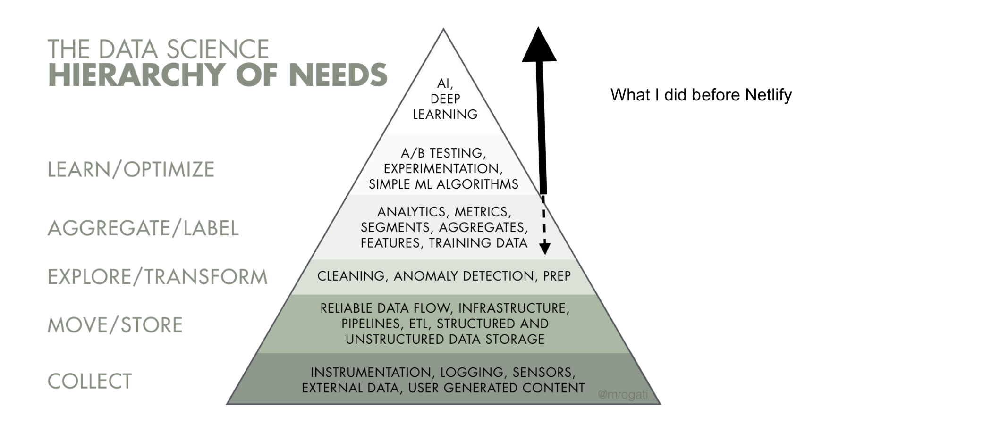
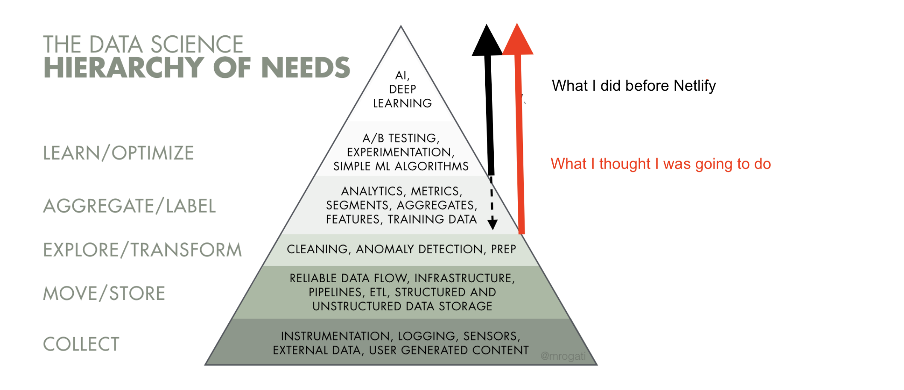
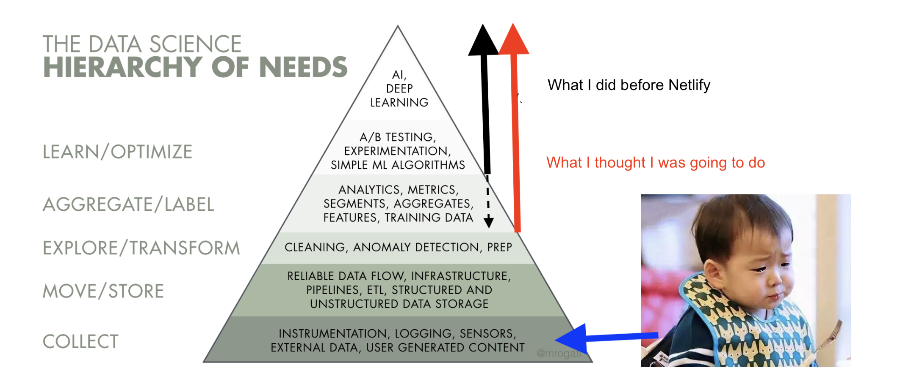
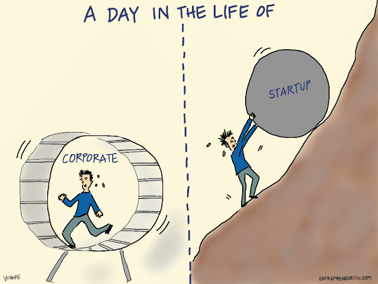

```{r setup, include=FALSE}
knitr::opts_chunk$set(echo = FALSE)
```

# Slides

<center>
<font size = "10">
 https://scientistcafe.com/talks/ODSC2019West
</font>
</center>


# What is a path?

<center>
{width=70%}
</center>

# The term no one really defined

- What is data science?

> Data science is the discipline of making data useful.  Ok...so what is it? 


# Three tracks of data science

1. Engineering (infrastructure and production): the process of making everything else possible 

2. Analysis: the process of turning raw information into insights in a fast way

3. Modeling/Inference: the process of diving deeper into the data to discover the pattern we don't easily see


(It is a group work from https://github.com/brohrer/academic_advisory/blob/master/authors.md !)

# Engineering

- Data environment: data storage, Kafka platform, Hadoop and Spark cluster etc.

- Data management:  parsing the logs, web scraping, API queries, and interrogating data streams. 

- Production: integrate model and analysis into the production system

# Data Pipeline

<center>
{width=70%}
</center>

# Analysis

- Domain knowledge

- Exploratory analysis

- Story telling

# Modeling/Inference

- Statistical Inference 

- Supervised learning

- Unsupervised learning

- Customized model development

# Some confusions and more to come

- Data infrastructure engineer v.s. Data engineer
- Data engineer v.s. BI engineer
- BI engineer v.s. Data analyst
- Data analyst v.s. Data scientist
- ...

# Three tracks of data science


# Three tracks of data science


# Three tracks of data science


# Data Science Hierarchy of Needs


# Data Science Types v.s Needs


# Data Science Types v.s Needs



# Data Science Types v.s Needs



# Data Science Types v.s Needs



# Where does data science belong in your organization?

<center>**1. A standalone team** </center>

- An autonomous unit parallel to engineering
- A strategic differentiator for the organization
- The head of data science unit should ideally report into the CEO or at least report into someone who understands data strategy and is willing to invest to give it what it needs. 
- Pros: 
    - autonomy
    - well positioned to tackle whatever problems it deems most valuable 
    - knowledge share and grow
    - attract/retain talent
- Cons: risk of marginalization

# Where does data science belong in your organization?

<center>**2. An embedded model**</center>

- Bring in talented people and farms them out to the rest of the company. There’s still a head of data science, but he/she is mostly a hiring manager and coach.
- Give up autonomy to ensure utility
- Pros: 
    - closer to applications
    - flexibility
- Cons: 
    - hard to attract/retain talent 
    - their embedded team leads don’t feel responsible for their growth and happiness, while their managers won’t feel directly vested in their work
    - data scientists are second-class citizens everywhere

# Where does data science belong in your organization?

<center>**3. Integrated team**</center>

- No separate data science team; each team hires and manages its own data scientists.
- Pros: 
    - optimizes for organizational alignment; 
- Cons: 
    - dilutes the identity of data science; 
    - hurt data scientist's career growth; 
    - sacrifice the flexibility of the embedded model

# Startup v.s. Big Corporate 

<center>
{width=70%}
</center>

http://bit.ly/2JlR9WU

# [Data Science Curriculum Roadmap](https://github.com/brohrer/academic_advisory/blob/master/curriculum_roadmap.md)


# Questions


