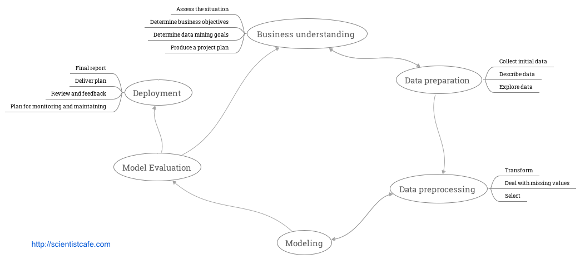

```{r setup, include=FALSE}
knitr::opts_chunk$set(echo = FALSE)
```

# [About Me](https://resume.scientistcafe.com/)

- Sep.2009 - Apr.2013: Consultant and Statistician, Iowa State University
- May.2013 - Apr.2018: Data Sciencist, DuPont
- May.2018 - present: Data Science, Netlify

> - Data Science = Code + Math + Domain Knowledge + Humanity
> - China - IA - CA
> - Others: [the truth that bothers me](https://linhui.org/images/Jokes/TruthOfHuman.png), know NOTHING about sports, [reading](https://hui1987.com), [drawing](https://linhui.org/photos/99art),
  [traveling](https://linhui.org/photos/), [collecting jokes](https://hui1987.com/english-jokes.html), [Notion](https://www.notion.so) - [Rabbit wiki](images/rabbitwiki.png)


# Before 2018-05


<figcaption> The pyramid of data needs <a href = "https://hackernoon.com/the-ai-hierarchy-of-needs-18f111fcc007">   illustrated by Monica Rogati </a></figcaption>

# Before 2018-05


# After 2018-05


# This is how I feel


# This is how I get started


# After 2018-05


# Case Study: Customer Retention

- General context without going into business details

- Focus on the technical parts

- Follow the data science project cycle


# Project Cycle



# Business Questions

1. How likely will a customer purchase?
2. What are the key drivers?

# Clarification Questions

- Who are our customers?
- Are there different segments of customers?
- What is a purchase?  
- How far ahead do we need to predict?
- What are the predictors? 
- What is the quality of the data?
- Where are the data located?
- ...

# Refined Question

- Response: if a corn multi-year customer will purchase again next year

- Predictors: other customer experience and behavior data

# Project Cycle

 

# Data Preprocessing

- Cleaning
- Missing values
- Transformation
    - Categorical
    - 0/1
    - percentage 
    - large positive number 
    - counts
    - $x_{ij}^{*} = \frac{x_{ij} - quantile(x_{.j}, 0.01)}{quantile(x_{.j, 0.99})- quantile(x_{.j}, 0.01)}$

# Project Cycle

 

# Multivariate Logistic Regression

- $\mathbf{y}=(y_{1},y_{2},\dots,y_{n})^{T}$  binary response vector
- $X=(\mathbf{x_{1}},\mathbf{x_{2}},\dots,\mathbf{x_{n}})^{T}$ design matrix in which each $\mathbf{x_{i}}$ is $p+1$ dimention column 
- $\mathbf{\beta}=(\beta_{0},\dots,\beta_{p})^{T}$ parameter vector

- The logliklihood function is as follows:

$$ln\mathcal{L}(\boldsymbol{\beta}|\mathbf{y})=\sum_{i=1}^{n}\left\{ y_{i}ln\frac{1}{1+exp(-\mathbf{x_{i}}^{T}\mathbf{\boldsymbol{\beta}})}+(1-y_{i})ln\left[1-\frac{1}{1+exp(-\mathbf{x_{i}}^{T}\boldsymbol{\beta})}\right]\right\} $$

$$D(\boldsymbol{\beta})\equiv\frac{\partial ln\mathcal{L}(\boldsymbol{\beta}|\mathbf{y})}{\partial\boldsymbol{\beta}}=\sum_{i=1}^{n}\left\{ y_{i}-\frac{1}{exp(-\mathbf{x_{i}}^{T}\boldsymbol{\beta})}\right\} \mathbf{x_{i}}$$


- Problems: quasi-complete-separation and significance based variable selection
- Solution: add penalty

# Lasso: Weighted L1-norm Penalty [Tibshirani 1996]

- $\hat{\beta}_{\lambda}=argmin_{\beta}(\parallel\mathbf{Y-X}\beta\parallel_{2}^{2}+\lambda\Sigma_{j=1}^{p}|\beta_{j}|)$
- Advantage: stabilize the estimation, also a variable selection tool
- Limitation: only selects individual dummy variables, the estimates are affected by the way dummy variables are encoded (M. Yuan and Y. Lin, Model selection and estimation in regression with grouped variables, J. R. Stat. Soc. Ser. B Stat. Methodol. 68 (2007), pp.49-67)


# Group Lasso Logistic Regression

- $\mathbf{x_{i,g}}$ vector of dummy variables ( $i^{th}$ observation in group $g$ ) $i = 1,...,n , g = 1,...,G$

- $y_{i}$ binary response for the $i^{th}$ observation

- $df_{g}$ degrees of freedom of group $g$

$$\mathcal{S}_{\lambda}(\beta)=-l(\beta)+\lambda\sum_{g=1}^{G}s(df_{g})\parallel\beta_{g}\parallel_{2}$$

where $l(\mathbf{\beta})$ is log-likelihood:

$$\Sigma_{i=1}^{n}\{y_{i}\eta_{\beta}(\mathbf{x_{i}})-log[1+exp(\eta_{\beta}(\mathbf{x_{i}}))]\}$$


$\lambda$ tuning parameter for penalty and $s(\centerdot)$ is $s(df_{g})=df_{g}^{0.5}$


# Performance Measure

- Maximize AUC
- Grid of 148 values $${0.96\lambda_{max},0.96^{2}\lambda_{max},\dots,0.96^{148}\lambda_{max}}$$ 
where 

$$\lambda_{max}=max_{g\in {1,\dots,G}}{\frac{1}{s(df_{g})}\parallel \mathbf{x_{g}^{T}(y-\bar{y})}\parallel_{2}}$$

# Model Training and Testing

- 70/30 (Train/Test)
- 10-fold cross validation (Train)
- Double check: one year holdout

# Cut-off Tuning
 
1. Ordered the score from high to low
2. Calculate the sensitivity and specificity as the cutoff changes
3. Get the cut-off values with corresponding likelihoods


# Project Cycle

 


# Model Comparison

- Traditional Stepwise Regression
- Random Forest
- SVM
- Neural Network

> Essentially, all models are wrong, but some are useful.


# Project Cycle


# Marketing Project Overview - Predictive Analytics

- Operational prediction [Annually]
- Final sale prediction [Monthly]
    - Linear model with step-AIC/Random forest/SVM with radial kernel
    - Super learner
        - nnet, knn, elastic network, ridge regression, partial lease square, AIC stepwise, MARS, GBM, rf, SVM
        - Prediction method designed to find the optimal combination of a collection of prediction algorithms
- Discount [Monthly]

# Marketing Project Overview - Segmentation

- Questionnaire design
    1. Needs: "We need ..."
    2. Behavior:  "We act like..."
- Prepare the data
    1. Survey the population
    2. Use a rating system
- Unsupervised learning
    1. Cluster analysis
    2. Determine number of segments
- Justification/Validation
    1. Information about growers that wasn't used to build the segment 
    2. Construct profiles
- Supervised learning
    1. Random forest analysis
    2. Gini score (select the most important questions)
 
# Marketing Project Overview- Program and Service Analysis

1. Customer connection program
2. Marketing Pilot Program (Sampling strategy, experimental design)
3. Promotion Program
    - Control group based: control for some or all of the potentially confounding influence of pretreatment control variables by reducing imbalance between the treated and control groups. After preprocessing in this way, any method of analysis that would have been used without matching can be applied to estimate causal effects
    - Coarsened Exact Matching (CEM)[http://gking.harvard.edu/cem/]
    - PSM
4. Causal Inference (Difficult!!)
    - Combined program analysis
    - Probabilistic Graphical Models
    - samiam: modeling and reasoning with Bayesian networks ([http://resaoning.cs.ucla.edu/samiam/](http://reasoning.cs.ucla.edu/samiam/))
    
# Marketing Project Overview - Social Media Analysis

- Find opinion leaders
- Get people involved
- Analyze what content will attract attention
- Sentiment around a specific product
- Network of the followers
- [Unstructured data analytics](http://hui1987.com/Presentations/UnlockUnstrDataMkt.html#(17)): digital marketing

# Marketing Project Overview -  Others

- Open-end survey text analysis: [Shiny App]([https://github.com/happyrabbit/BTI2016_12_29/tree/master/Rcode/Shiny_NLP](https://github.com/happyrabbit/BTI2016_12_29/tree/master/Rcode/Shiny_NLP))
- Longitudinal analysis (among perceptions and perception-purchase, `lavann`, `sem`)
- Cross-sell (Market basket analysis)
